# Cinemary

Cinemary is an online platform where users can read and make reviews about movies and series. The app interface allows users' interactions to list, create, edit and delete posts or comments, filter posts using the search bar, and like and unlike posts. Cinemary was built with React, to achieve the best User Experience possible, adding an infinite scroll and components that update without the whole document being refreshed. In this way, users can like/unlike, create and edit comments and don't have to wait for the page to refresh.

---

---

## Features

### Landing Page - Posts List

The landing page displays all posts created by all users. Every user (logged in or logged out) can access this page and filter posts using the search bar.

- User Story: List Posts

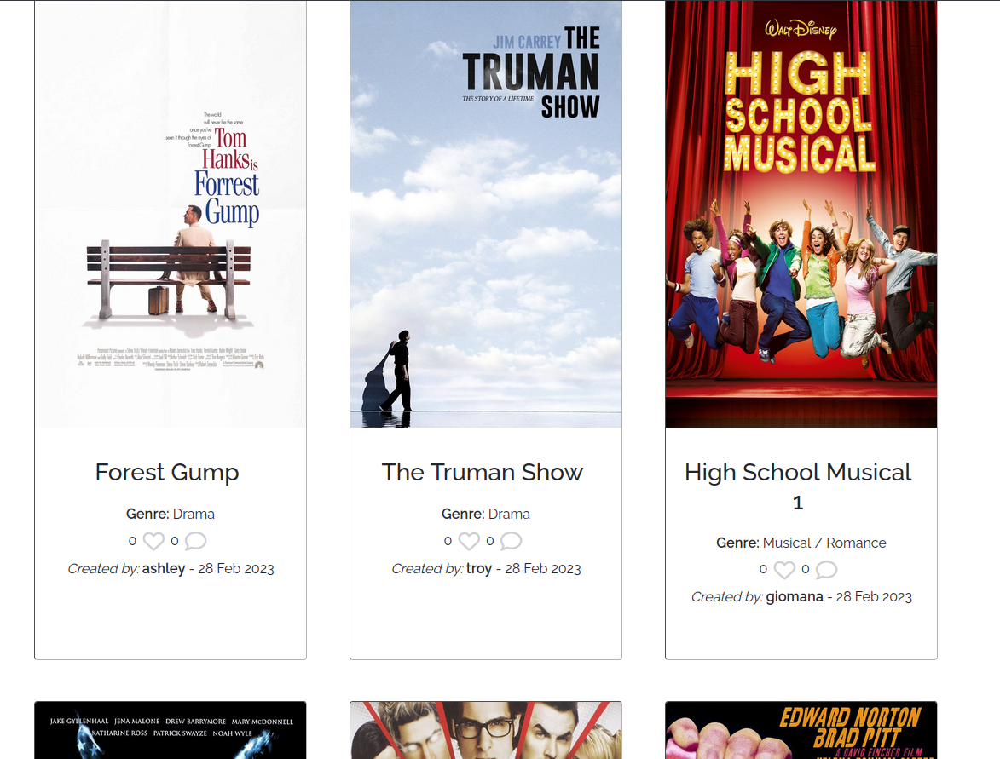

### Navigation Bar

To navigate through the website, users can use the nav bar. When users are not logged in, the navbar can take users to the sign-in, sign-up, or reviews page. When logged in, the nav bar options are Reviews, Liked, and a dropdown menu with the user's username, that allows the user to change credentials or log out. The navigation bar options collapse into a burger menu, in small screen sizes. The navbar is a component present on all pages.

- User Story: Navigation Bar

### Sign Up

To be able to use all website features, users must create an account. Allauth was used to create this feature and handles all the authentication.

- User Story: Create an Account

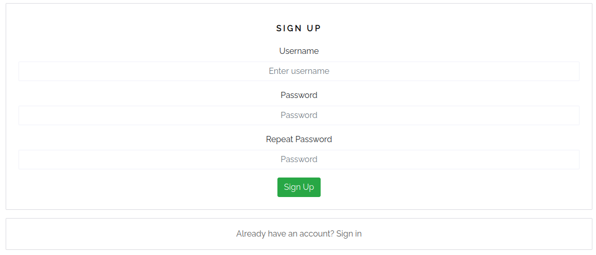

### Sign in and Logout

After an account has been created, users can log in and log out from their accounts.

- User Story: Sign In and Logout

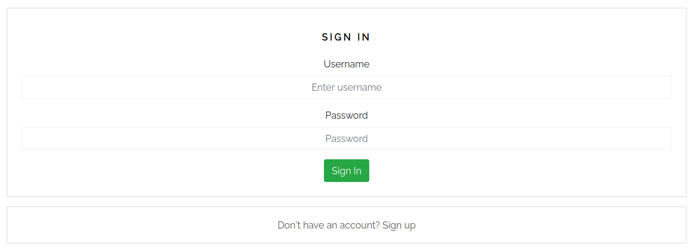

### Create Review

This page contains a form, that allows users to create their reviews. They have to provide a title, genre, content, and image. The creation date and author's username are set automatically.

- User Story: Create a Post

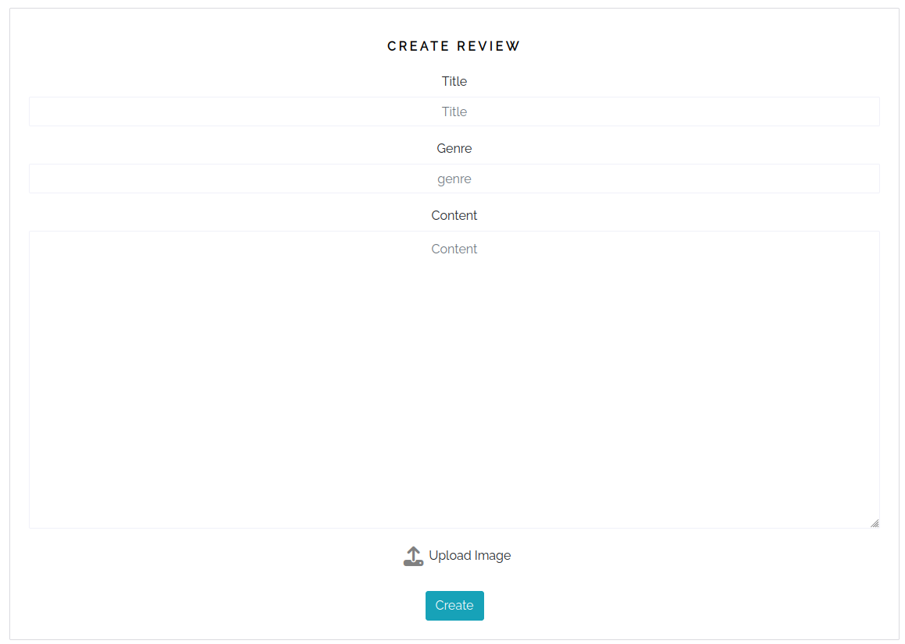

### Edit or Delete Review

If the user is logged in and owns the post, the post on the landing page will display a dropdown menu. Within this menu, users can edit or delete their reviews.

- User Story: Edit Post and Delete Post.

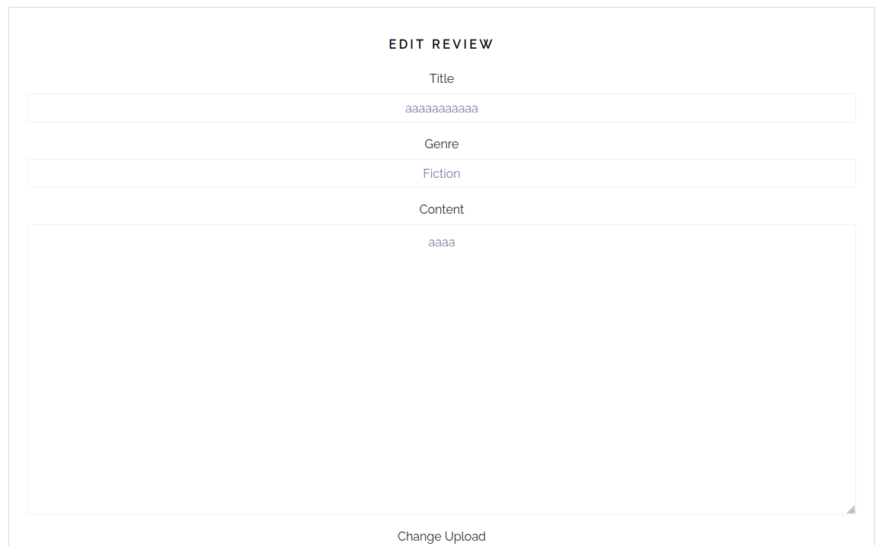

### Review Page

After a user clicks on a post, they are redirected to the review detailed view. On this page, they have access to the review content and can read comments and create comments (if logged in).

- User Story: Post Page

### Liked Reviews

This page is identical to the home page, the difference is that only displays reviews that were liked by the user. Logged Out users are redirected.

- User Story: Filter Post

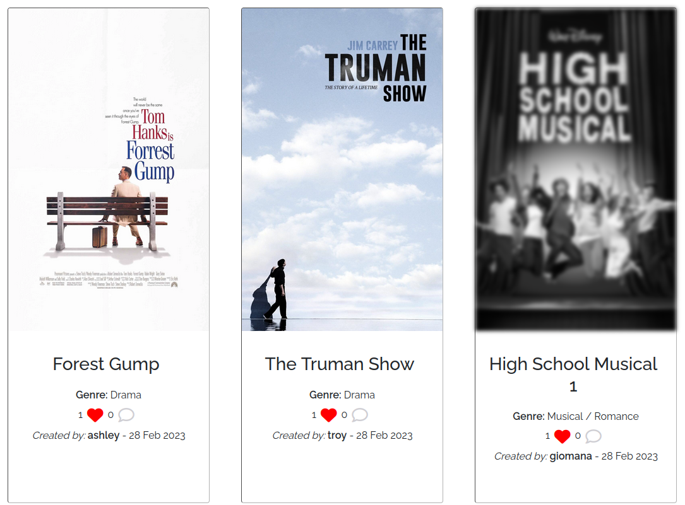

### Search Reviews

On the home page and the liked page, there is a navbar that allows users to filter posts by title, genre, or review author's name.

- User Story: Search Post and Filter Post

### Like and Unlike

All users can see how many likes a review has. But only logged users can click the button to either like or unlike posts.

- User Story: Like and Unlike Posts

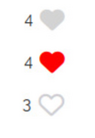

### Create Comment

Only logged-in users can create new comments.

- User Story: Create a Comment

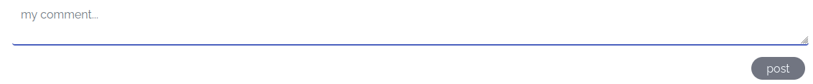

### List Comment

All users can see the comment list.

- User Story: List Comment

### Edit or Delete Comment

If a user is logged in and owns a comment, a dropdown will be displayed that allows the comment to be updated or deleted.

- User Story: Edit Comment and Delete Comment

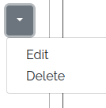

### Infinite Scroll

The page is refreshed as the user scrolls down loading more posts.

- User Story: No Refresh

### Change Password

- Logged-in users can access the change credentials page through the dropdown menu on the navbar. There, users are allowed to update their password.

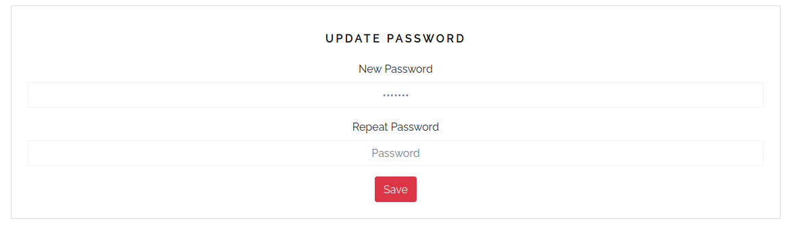

### To check all features and future features, check the project on [GitHub](https://github.com/users/Vepp1/projects/4)

---

## Wireframe

- The main idea was to build an app that would be easily accessible to all users, with an infinite scroll and a card display inspired by streaming interfaces.

## 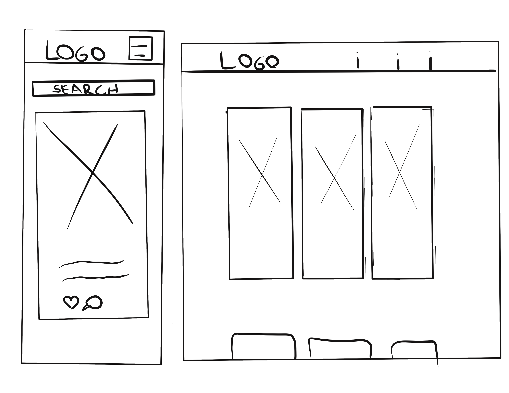

## Testing and Validation

### Manual Testing

### Access Liked or Create without being logged in, through the address bar.

- On the address bar, type /liked or /create after the website's URL.
- Result: The user is redirected to the home page.

### Edit or delete a post from another user.

- 2 accounts are needed. In one account, make a post and save its id. Log out and log in to a new account. Then, go to the address bar and type after the site's URL: edit/"post_id" - to try to edit. delete/order id from the other account - to try to delete.
- Result: The user is redirected to the home page.

### Update password from another account.

- After logging into an account try to access the URL: profiles/'profile_id' and change the profile id to a different number:
  edit_order/your approved order id/ - to try to edit. delete_order/your approved order id/ - to try to delete.
- Result: The user is redirected to the home page.

### Create or edit a post with an image of an invalid format.

- After logging into an account try to access go to create and try to create a review with an image that is not a jpeg file.
- Result: Alert message will be displayed and a post will not be created.

### Create or edit a post with a title or genre with more than 50 characters.

- After logging into an account try to access go to create and try to add a post with an exceptionally long title or genre.
- Result: Alert message will be displayed and a post will not be created.

### Validator Testing

- CSS

  - No errors were found when passing through the official [(Jigsaw) validator](https://jigsaw.w3.org/css-validator/validator?uri=https%3A%2F%2Fcinemary.herokuapp.com%2F&profile=css3svg&usermedium=all&warning=1&vextwarning=&lang=en)

- JSX

  - All files passed through Eslint.

- PEP8

  - All pages passed through vs code python linter.

- Color Contrast
  - The website's color contrast was validated through [a11y](https://color.a11y.com/Contrast/), and presented no issues.

### Unfixed Bugs

There are no present bugs in this version.

---

## Deployment

- The live link can be found [here](https://cinemary.herokuapp.com/).
- [GitHub Repo](https://github.com/Vepp1/cinemary).

#### GitHub/GitPod

- Forking the GitHub Repository:

  - If you want to make changes to your repository without affecting it, you can make a copy of it by 'Forking' it. This ensures your original repository remains unchanged.
  - Find the relevant GitHub repository
  - In the top right corner of the page, click the Fork button (under your account)
  - Your repository has now been 'Forked' and you have a copy to work on
  - Cloning the GitHub Repository

- Cloning your repository will allow you to download a local version of the repository to be worked on.

  - Find the relevant GitHub repository.
  - Press the arrow on the Code button.
  - Copy the link that is shown in the drop-down.
  - Now open Gitpod & select the directory location where you would like the clone created.

  - In the terminal type 'git clone & then paste the link you copied in GitHub. - Press enter and your local clone will be created.

---

## Credits

### Content

- The icons in the footer were taken from [Font Awesome](https://fontawesome.com/)
- The font was taken from [Google Fonts](https://fonts.google.com/)
