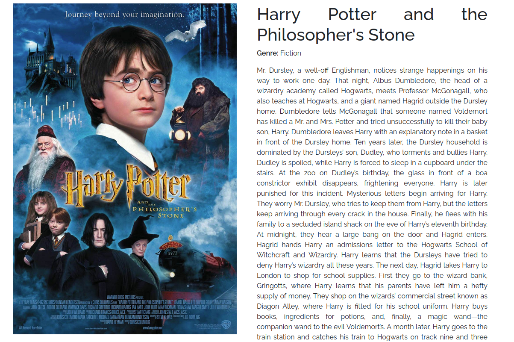
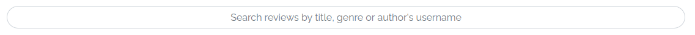

# Cinemary

Cinemary is an online platform where users can read and make reviews about movies and series. The app interface allows users' interactions to list, create, edit and delete posts or comments, filter posts using the search bar, and like and unlike posts. Cinemary was built with React, to achieve the best User Experience possible, adding an infinite scroll and components that update without the whole document being refreshed. In this way, users can like/unlike, create and edit comments and don't have to wait for the page to refresh. When accessing the Website, users can search and read reviews without being logged in. If they want to save(like), comment, or create reviews, they need to Sign Up. On the Sign-Up page, they are asked to provide a username and password. After a successful Sign-Up, users are redirected to the Sign In page, where they have to input their login information. Once a user is logged into his account, the navbar options are updated. Now, the users can create a review, edit, and delete their reviews, comments, and likes. The project's goal is to build a community of movie fans, where people can share their thoughts about pieces and also find new suggestions on what to watch next.

---

---

## Features

### Color Palette and Typography

The colors and Font-Family (Unbounded and Sans-Serif) were chosen to give the application a 'Light Theme' and a minimalist design.

### Landing Page - Posts List

The landing page displays all posts created by all users. Every user (logged in or logged out) can access this page and filter posts using the search bar.

- User Story: List Posts

### Navigation Bar

To navigate through the website, users can use the nav bar. When users are not logged in, the navbar can take users to the sign-in, sign-up, or reviews page. When logged in, the nav bar options are Reviews, Liked, and a dropdown menu with the user's username, that allows the user to change credentials or log out. The navigation bar options collapse into a burger menu, in small screen sizes. The navbar is a component present on all pages.

- User Story: Navigation Bar

### Sign Up

To be able to use all website features, users must create an account. Allauth was used to create this feature and handles all the authentication.

- User Story: Create an Account

### Sign in and Logout

After an account has been created, users can log in and log out from their accounts.

- User Story: Sign In and Logout

### Create Review

This page contains a form, that allows users to create their reviews. They have to provide a title, genre, content, actors, release date, and image. The creation date and author's username are set automatically.

- User Story: Create a Post

### Edit or Delete Review

If the user is logged in and owns the post, the post on the landing page will display a dropdown menu. Within this menu, users can edit or delete their reviews.

- User Story: Edit Post and Delete Post.

### Review Page

After a user clicks on a post, they are redirected to the review detailed view. On this page, they have access to the review content and can read comments and create comments (if logged in).

- User Story: Post Page

### Liked Reviews

This page is identical to the home page, the difference is that only displays reviews that were liked by the user. Logged Out users are redirected.

- User Story: Filter Post

### Search Reviews

On the home page and the liked page, there is a navbar that allows users to filter posts by title, genre, actors, director, or review author's name.

- User Story: Search Post and Filter Post

### Like and Unlike

All users can see how many likes a review has. But only logged users can click the button to either like or unlike posts.

- User Story: Like and Unlike Posts

### Create Comment

Only logged-in users can create new comments.

- User Story: Create a Comment

### List Comment

All users can see the comment list.

- User Story: List Comment

### Edit or Delete Comment

If a user is logged in and owns a comment, a dropdown will be displayed that allows the comment to be updated or deleted.

- User Story: Edit Comment and Delete Comment

### Infinite Scroll

The page is refreshed as the user scrolls down loading more posts.

- User Story: No Refresh

### Change Username and Password

- Logged-in users can access the change username and password pages through the dropdown menu on the navbar.

### Reuse of React

The use of React to develop this application, allowed the reuse of components through different pages, increasing the loading speed and giving a better user experience. The navbar and search bar can be found on different pages, using the same component. Users can see new likes and comments, without the pages being reloaded. The Movie component is used to display the reviews both on the home and liked pages.

### To check all features and future features, access the project on [GitHub](https://github.com/users/Vepp1/projects/4)

---

## Wireframe

## 

## 

---

---

## Frontend Libraries

  ### React
    - Create reusable components, infinite scroll, and build a lightweight application, aiming for the best user experience.

  ### React Bootstrap.
    - Build a responsive website and choose between a collection of syntax to deliver the best template design.

  ### FontAwesome
    - Icon library and toolkit, to customize frontend.

---

## Testing and Validation

### Manual Testing

### Access Liked or Create without being logged in, through the address bar.

- On the address bar, type /liked or /create after the website's URL.
- Result: The user is redirected to the home page.

### Edit or delete a post from another user.

- 2 accounts are needed. In one account, make a post and save its id. Log out and log in to a new account. Then, go to the address bar and type after the site's URL: edit/"post_id" - to try to edit. delete/"post_id" - to try to delete.
- Result: The user is redirected to the home page.

### Update username and password from another account.

- After logging into an account try accessing the URL: profiles/'profile_id' and change the profile_id to a different number.
- Result: The user is redirected to the home page.

### Create or edit a post with an image in an invalid format.
- After logging into an account, go to Create and try to create a review with an image that is not a jpeg file.
- Result: Alert message will be displayed and a post will not be created.

### Create or edit a post with an image that doesn't have the correct size.
- After logging into an account, go to Create and try to create a review with an image that is not a movie poster.
- Result: Alert message will be displayed and a post will not be created.

### Create or edit a post with a title of more than 50 characters.

- After logging into an account try to create a post with an exceptionally long title.
- Result: Alert message will be displayed and a post will not be created.

### Edit or delete another user's comment.

- After logging into an account access the review page and try to edit a comment by switching classes on DevTools.
- Result: Comments will not be updated.

### NavBar collapsing on mobiles.

- On a mobile display, click on the navbar links and check if the navbar auto-collapses.
- Result: Navbar is collapsing after links are clicked.

### Cross Browser Testing.

- Go through all possible user journeys on the website, on different browsers.
- Result: The application is working in different browsers. Log-in on iOS mobile devices is not working.

### Accessibility and performance.

- Utilize LightHouse to measure accessibility and performance.
- Result: 

### Validator Testing

- CSS

  - No errors were found when passing through the official [(Jigsaw) validator](https://jigsaw.w3.org/css-validator/validator?uri=https%3A%2F%2Fcinemary.herokuapp.com%2F&profile=css3svg&usermedium=all&warning=1&vextwarning=&lang=en)

- JSX

  - All files passed through Eslint.

- Color Contrast
  - The website's color contrast was validated through [a11y](https://color.a11y.com/Contrast/), and presented no issues.

---

### Unfixed Bugs

- Creating and logging into an account is not working on IOS mobile devices.

---

## Deployment

### Heroku

- Deploying to Heroku:
  - Access www.heroku.com.
  - Click on New and Create New App.
  - Choose an App name and a region and Create an App.
  - On the Deployment tab, connect to GitHub and choose the proper repository.
  - Deploy Branch.

#### GitHub/GitPod

- Forking the GitHub Repository:

  - If you want to make changes to https://fontawesome.com/page, click the Fork button (under your account)
  - Your repository has now been 'https://fontawesome.com/Forked' and you have a copy to work on
  - Cloning the GitHub Repository

- Cloning your repository will allow you to download a local version of the repository to be worked on.

  - Find the relevant GitHub repository.
  - Press the arrow on the Code button.
  - Copy the link that is shown in the drop-down.
  - Now open Gitpod & select the directory location where you would like the clone created.

  - In the terminal type 'git clone & then paste the link you copied in GitHub. - Press enter and your local clone will be created.

---

## Credits

### Content

- The icons in the footer were taken from [Font Awesome](https://fontawesome.com/)
- The font was taken from [Google Fonts](https://fonts.google.com/)
